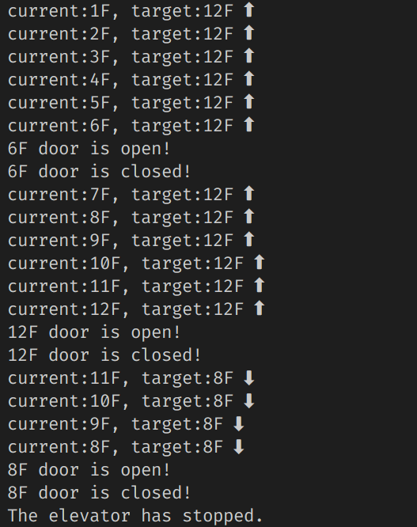

# Elevator Simulation
A simple elevator simulation program  
implemented in c, without GUI.  
It can realize the up and down button operation on each floor and the button operation inside the elevator.  
Because unistd.h is used, it can only be run on Unix-like systems.  
Compile and run:  
```shell
make
./elevator
```
The test program was written in main.c  

example:  


Maybe multi-thread simulation will be added in the future to enable real-time input.

---
<br>
<br>

# 电梯模拟器
一个用c实现的简单电梯模拟程序，无GUI。  
可以实现每层楼上下按钮操作、电梯内部按钮操作
因使用到了unistd.h，只能在类unix系统上运行。  
编译运行：  
```shell
make
./elevator
```
测试程序在main.c中  

测试样例结果：  


也许以后会加入多线程模拟，做到可以时实输入  